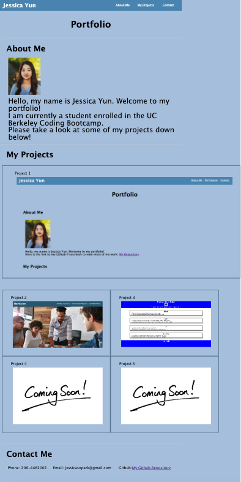

# Portfolio

## Description

This website showcases my portfolio. It holds information about myself along with some of the projects that I have worked on. The viewer could use this website to find out more about me and some of the work that I have done. It contains notes on HTML and CSS. 
Here is the link to the website: https://jssoyoung.github.io/Portfolio/
Here is an image of the website: 

## Installation

N/A

## Usage

The website is divided into many sections. The header states my name, along with a navigation bar at the top. Right underneath "Portfolio" is written as the title of the website. The main part of the body contains is then again divided into three sections: an about me section, a projects section, and a contacts section. The about me section contains a picture of myself along with text that introduces myself. The projects section contains five pictures of my work. The pictures can be clicked and will move the viewer to the github repository connected with that project. The contacts section contains my phone number, email and a link to my github. The different sections are marked with semantic HTML elements and alt attributes for all images used.

## Credits

N/A 

## License

Please refer to the LICENSE in the repo.
